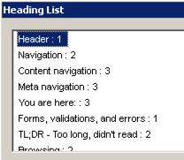

# How to work with headings

# Keyboard-only usage

Nothing extraordinary to say here, just be sure to have thoroughly read [How to read and interact with websites using keyboard-only](/knowledge-about-developing-and-testing-accessible-websites/introduction-to-keyboard-only-usage/how-to-read-and-interact-with-websites-using-keyboard-only){.page}!

# Screen reader usage

**Important:** The following is only a small refresher! Before you proceed, please be sure to have thoroughly read [Introduction to desktop screen reader usage](/knowledge-about-developing-and-testing-accessible-websites/introduction-to-desktop-screen-reader-usage){.page}!

## Quick navigation

- `H`: jump to next heading
- `1` (up to `6`): jump to next heading on level 1 (up to 6)

**Note:** You can add `Shift` to most shortcuts to reverse direction, e.g. press `Shift + H` to jump to the **previous** heading.

## Display headings outline

As alternative to navigating through the headings directly on the page, screen readers offer a heading outline view.

### NVDA "Elements List"

{.image}

NVDA's "Elements List" displays a page's heading outline in a **tree view**:

- `Insert + F7` to open "Elements List", then `Alt + H` to select "Headings" area
    - Be sure not to focus a text input while doing this, see [NVDA #7763: Why does Insert+F7 not work when focusing a text input?](https://github.com/nvaccess/nvda/issues/7763)
- This dialog offers some useful filter options

### JAWS "Heading List"

{.image}

JAWS's "Heading List" displays a page's heading outline in a **list view**:

- `Insert + F6` to open "Heading List"
- This dialog offers some useful sort and filter options

# Bookmarklets

- "h123" bookmarklet
    - An efficient way to display the current webpage's heading outline
    - Without the need to fire up a screen reader!
- "Contents structured" bookmarklet
    - Highlights a lot of HTML elements (incl. headings), conveying their tag names
    - Allows for fast visual detection of wrong (or missing) headings!

See [Bookmarks and bookmarklets](/section--setting-up-the-accessibility-testing-environment---introduction/web-browsers/bookmarks-and-bookmarklets){.page}.

TODO: More?!