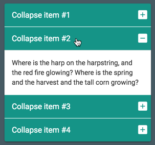

# Accordion widgets

{.image}

Accordions help to save vertical space and prevent from visual noise. Some accordions allow only a single one panel to be expanded at a time, others allow multiple.

# Similarities with tablists and carousels

Before you continue, please read [Tablist widgets (a.k.a. tab panels, tabs)](/code-examples-of-common-patterns-and-daily-requirements/interactive-javascript-and-widgets/tablist-widgets--a-k-a--tab-panels--tabs-){.page} to understand why accordions simply are extended variants of tablists, providing a slightly different layout and (sometimes) expandability of multiple panels.

# Requirements

In addition to the tablists' requirements:

- Multiple panels must be expandable (optional)

Find more detailed requirements here: [WAI-WAI-ARIA Authoring Practices: Accordion (widget)](https://www.w3.org/TR/2013/WD-wai-aria-practices-20130307/#accordion).

# Proofs of concept

See: [What is a "Proof of concept"?](/code-examples-of-common-patterns-and-daily-requirements/interactive-javascript-and-widgets/what-is-a-proof-of-concept){.page}

## Radio buttons implementation

Based on the tablists' proof of concept, simply the layout is different.

[**Proof of concept: Accordion**](https://codepen.io/accessibility-developer-guide/pen/JOMZXE){.code}

## Checkboxes implementation

Based on the tablists' proof of concept:

- The layout is different
- Checkboxes replace the radio buttons to offer multiple selection
    - We waived using a `<fieldset>`/`<legend>` combination, as this is no traditional group of checkboxes (also, JAWS tends to be very wordy with focusable items nested within those)

[**Proof of concept: Accordion Multi**](https://codepen.io/accessibility-developer-guide/pen/eeyKgp){.code}

**Notice:** By default, only the `Space` key is used to toggle a checkbox (while pressing `Enter` submits a form). To make it more intuitive for visual users (who don't know about any checkbox behind the scenes, and thinking they're interacting with a link or button), the `Enter` key was re-wired to also toggle the checkboxes.

## Simple ARIA implementation

It's relatively simple to create a custom carousel implementation using simple ARIA: Just add a link around each panel's header, and an `aria-expanded` attribute. Then toggle its value (`true`/`false`) and the visibility of the corresponding panel using JavaScript!

[**Accordion: Proof of concept**](https://codepen.io/accessibility-developer-guide/pen/vWpWmq){.code}

While this may feel tempting in some circumstances, there are several drawbacks:

- It needs more JavaScript (instead of relying on browser standard behaviour)
- This solution is less intuitive: a screen reader announcement "link X collapsed" is less expressive than "show panel X checkbox not checked" or "show panel X radio button not checked 2 of 3"
- Missing backwards compatibility for older clients with incomplete/missing ARIA support

So in line with [Our codex about clean and maintainable accessibility](/knowledge-about-developing-and-testing-accessible-websites/our-codex-about-clean-and-maintainable-accessibility){.page}, we urge you to always favour browser standard behaviour over ARIA.

# 3rd party widgets

Find below some ready-to-use 3rd party widgets that satisfy our requirements regarding to accessibility. See [How we evaluate JavaScript widgets](/code-examples-of-common-patterns-and-daily-requirements/interactive-javascript-and-widgets/how-we-evaluate-javascript-widgets){.page}.

TODO