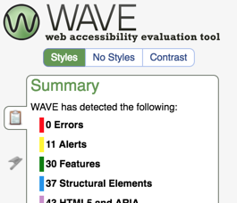

# Chrome browser: installation and configuration

{.image}

Though Chrome has its own official screen reader add-on [ChromeVox](https://chrome.google.com/webstore/detail/chromevox/kgejglhpjiefppelpmljglcjbhoiplfn), it's not widely used and thus not relevant in these terms.

But it's the most spread browser in the web developer community, and it offers some great add-ons.

For more info, see [Relevant combinations of screen readers and browsers](/knowledge-about-developing-and-testing-accessible-websites/introduction-to-desktop-screen-reader-usage/relevant-combinations-of-screen-readers-and-browsers){.page}.

# Installation

- [Download Chrome](https://www.google.com/chrome/browser/desktop/) and install it

# Configuration

## Restoring tabs after restart

You may want to [restore tabs in Chrome upon restart](https://productforums.google.com/forum/#!topic/chrome/7JoWEVz3CK8).

## WAVE toolbar

{.image}

- WAVE is best used to get very quick first impression of a the accessibility of a webpage
- WAVE is a web accessibility evaluation tool developed by [WebAIM.org](https://webaim.org/)
- It provides visual feedback about the accessibility of the currently browsed webpage by injecting icons and indicators into it
- [Download WAVE Evaluation Tool](https://chrome.google.com/webstore/detail/wave-evaluation-tool/jbbplnpkjmmeebjpijfedlgcdilocofh) and install it
- Notice: There's also also exists as online service [wave.webaim.org](http://wave.webaim.org/)
- Notice: This also exists for Firefox, but it's outdated!