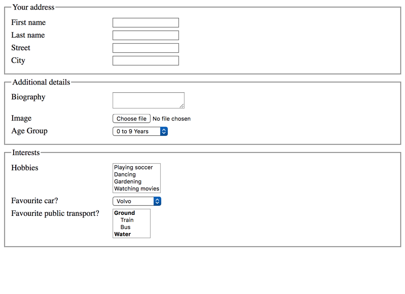

# Grouping form controls with fieldset and legend

**Grouping form controls in a meaningful way can make them much easier to handle for everyone. While most controls can be grouped, some must be grouped. The fieldset/legend structure is available for exact that - it can even be nested. And if its visual limitations are a problem, ARIA can be of help.**

`<fieldset>`/`<legend>` structures are used for grouping form controls that are related in some way. While in complex forms they can be used to group all kinds of form controls, groups of radio buttons and checkboxes should always be grouped by them.

## Grouping any kinds of controls

### Grouping thematically

The more complex forms are, the more it makes sense to group thematically related form controls of any kind.

[Grouped thematically related form controls (example) ](_examples/grouped-thematically-related-form-controls)

By the way, it is not mandatory to group all your form controls. In the example above, you could easily drop the grouping of interests (or any other). In general: use groupings of thematically related controls whenever it feels meaningful to you and your users.

### Grouping to differentiate

Another use case is differentiating groups with similar input fields, for example to tell apart shipping and billing address.

[Grouped and differentiated form controls (example) ](_examples/grouped-and-differentiated-form-controls)

## Grouping certain kind of controls

### Radio buttons

Groups of radio buttons are used as possible answers to a certain question, and as such they are always related to each other. Hence they are always grouped, while the `<fieldset>`'s `<legend>` contains the question and each control's `<label>` contains an answer.

[Grouped radio buttons (example) ](_examples/grouped-radio-buttons)

This is also reflected by the fact that each radio button's `name` attribute is identical.

### Checkboxes

Groups of checkboxes are very similar to radio buttons, and hence are grouped most of the time:

[Grouped checkboxes (example) ](_examples/grouped-checkboxes)

In contrast to radio buttons though, checkboxes do not imperatively relate to each other. So there may be situations where a number of non-related checkboxes can stand on their own, without being grouped:

[Non related checkboxes (example) ](_examples/non-related-checkboxes)

This is also reflected by the fact that each checkbox's `name` attribute is different.

Notice: single checkboxes, like "Accept terms and conditions", do not need a `<fieldset>`/`<legend>`. Still, it can make perfect sense to put them into their own `<fieldset>`/`<legend>`, maybe together with some related link(s) or text (see [Placing non-interactive content between form controls](/pages/examples/forms/non-interactive-content)).

## Nesting

Nesting `<fieldset>`/`<legend>` structures is possible, especially when groups of radio buttons or checkboxes play a role.

[Nested fieldset/legend structures (example) ](_examples/nested-fieldsetlegend-structures)

But you should not overdo that: while screen readers uniformly announce when a grouping is entered, some do not announce when it is exited. As such, too much nesting can quickly become confusing.

## Keeping legends short

Regarding `<fieldset>`/`<legend>` structures, some screen readers are much wordier than others.

On one side, JAWS attaches the `<legend>`'s text to the label of each contained form control. For a `<legend>` with the text "Personal Details" and two fields "First Name" and "Last Name", it literally announces:

> Personal Details, First Name.
> Personal Details, Last Name.

On the other side, NVDA only announces the `<legend>`'s text when entering the `<fieldset>`. For the above example, it literally announces:

> Personal Details, Grouping. First Name.
> Last Name.

[Grouped form controls with too long legend (example) ](_examples/grouped-form-controls-with-too-long-legend)

Conclusion: never put long texts into the `<legend>` element. If you really need to put long text into a form, there are other approaches, see [Placing non-interactive content between form controls](/pages/examples/forms/non-interactive-content).

## Legend must be a direct child of fieldset

HTML requires the `<legend>` element to be the first child of `<fieldset>`.

This is correct:

```html
<fieldset>
  <legend>Gender</legend>
</fieldset>
```

This is problematic:

```html
<fieldset>
  <div>
    <legend>Gender</legend>
  </div>
</fieldset>
```

This is also problematic:

```html
<fieldset>
  <div>...</div>
  <legend>Gender</legend>
</fieldset>
```

As a result, some screen readers seem to have difficulties associating the `<legend>` correctly to its `<fieldset>` if it is not its first child.

## Overcoming visual limitations using ARIA

Admittedly, browsers have a quite peculiar opinion on how to visually style `<fieldset>`/`<legend>` structures, and it is quite hard to override their preferences.

So if for visual (or any other serious) reason you can't use standard `<fieldset>`/`<legend>`, you may take ARIA to the rescue:

- Use `role="group"` to give a `<div>` container the semantics of a `<fieldset>`.
- Associate any other text to the grouping container using `aria-describedby`.

[Faked fieldset/legend using ARIA (example) ](_examples/faked-fieldsetlegend-using-aria)

As always, we highly recommend to use traditional solutions over ARIA, so if you haven't done this yet, go back and read [ARIA - when HTML simply isn't enough](/pages/knowledge/aria).