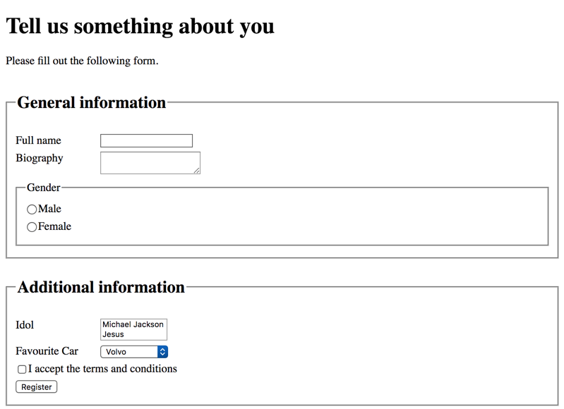

# Grouping form controls with headings

**It sometimes feels necessary to group complex forms visually using headings. As traditionally used headings are non-focusable elements, you have to make sure that they are not missed by screen reader users in focus mode.**

Although it is the traditional way to group form controls using `<fieldset>`/`<legend>` structures (and they are even capable of being nested), sometimes there is the need to use headings within forms. But those headings are not announced in focus mode by default (if you haven't done this yet, go back and read [Screen readers' browse and focus modes](/pages/knowledge/desktop-screen-readers/browse-focus-modes)).

## HTML 5.2 allows heading as child of legend

The good news: since HTML 5.2, headings are allowed within `<legend>` elements, see [The legend element (W3.org)](https://www.w3.org/TR/html52/sec-forms.html#the-legend-element).

[Headings mixed into a form as children of legends (example) ](_examples/headings-mixed-into-a-form-as-children-of-legends)

By the way, the other way round (placing legends into headings) doesn't work, because a `<legend>` always has to be the first child of its `<fieldset>`.

## Faking fieldset/legend using ARIA

Just for the sake of completeness, here is another possible solution. As we know from [Grouping form controls with fieldset and legend](/pages/examples/forms/grouping-with-fieldsetlegend), we can fake `<fieldset>`/`<legend>` structures using ARIA. Alas, we could simply use a heading for that.

Here is the same example as above, but with ARIA:

[Headings mixed into a form using ARIA (example) ](_examples/headings-mixed-into-a-form-using-aria)

We advise to rather stick to the solution of HTML 5.2 instead of using ARIA.

## Conclusion

Although it is possible to mix headings into forms, you should be careful with that. For example, when a heading is announced as part of a `<fieldset>`'s `<legend>`, its level (`<h1>`, `<h2>`, etc.) is omitted, which then could lead to confusion.

So in general, try to keep your forms as easy as possible. It often is better to split a complex form into different steps than displaying it on one single page.