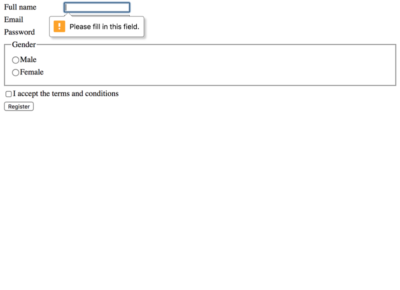
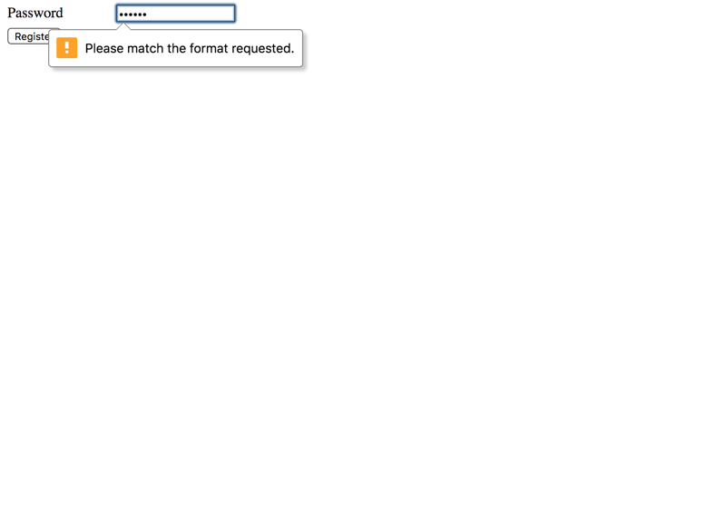
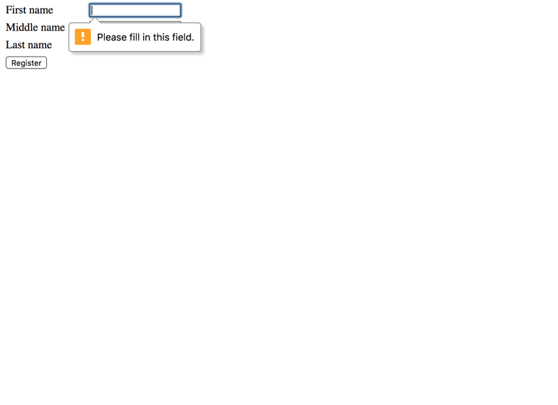

# HTML 5 client side validations

**HTML 5 client side validations are a very useful feature: they allow rudimentary validation of user data without submitting anything to the server. They are supported to a high degree by modern browsers and screen readers. Still, you should obviously never think of them as a complete replacement for server side data validation.**

## Benefits

HTML 5 client side validations have a lot of benefits, for example:

- They make resolving validation errors faster and more understandable, thus resulting in a better user experience.
- As such, they can also reduce network and server load.

## Implicit and explicit validations

Validations can be added in two ways:

1. Implicitly by setting the `type` of an input to a value that comes with some validations by itself, for example `type="email"`.
2. Explicitly by adding validations manually through the respective attributes, for example `required` or `pattern`.

## Demonstration

The following example demonstrates a few of those validations:

- All inputs are required (using `required` attribute).
- The "Email" input checks for a valid input format (using `type="email"` attribute).
- The "Password" input checks for a custom pattern (using `pattern="(?=.*\d)(?=.*[a-z])(?=.*[A-Z]).{6,}"` attribute).
    - This requires an input of at least six characters with at least one number, one lowercase and one uppercase letter.
    - To make the pattern available to the user in a human readable form, you can use the `title` attribute like this: ` title="Minimum 6 characters containing lowercase, uppercase, and at least one number"`.

[HTML 5 client side validations (example) ](_examples/html-5-client-side-validations)

You should only be capable of submitting the form when all input is valid.

## Browser differences

All browsers handle these validations to their likings. In general, they work quite similar: when the user submits the form, the browser sets the focus automatically to the first invalid input. The validation error is then announced by the screen reader.

A few notes though:

- Some screen readers announce missing required values automatically as "invalid", others don't.
- Some screen readers announce both an input's name and validation error, others only announce the validation error.
    - The latter case is a minor inconvenience, as the user may have to find out the input's name manually (which is easy, but still an annoyance).

## Using the invalid attribute

If you like, you can manually set the attribute `invalid` to an invalid input:

```html
<input type="text" invalid />
```

But please do so only after the user has already interacted with the input: it is annoying to visit a "fresh" form and have all required (but initially empty) fields announced as "invalid" by default.

In general though it is better to attach a distinctive validation message to an invalid input, see [Validation messages](/pages/examples/forms/validation-messages).

## Custom patterns need a title

As seen in the example above, it is good practice to provide a human readable explanation of a required `pattern` using the `title` attribute. Its value will be displayed together with the browser's validation error.

Notice that this does not work for other validation types. So for example, it is not possible to override the standard message for inputs that have only a `required` attribute.

### Internet Explorer peculiarity

From an accessibility point of view, for Internet Explorer it is not only good practice, but it's a clear requirement. Because if an input requires a specific `pattern`, but has no `title`, JAWS does not announce any validation error. So while a visual user at least sees a small popup "You must use this format" (admittedly not being of much help), a JAWS user will feel totally frustrated as there is no clue about a specific format.

The following example is especially problematic, as the field not only requires a specific pattern - it is also marked up as `required`: so users feel like they have done everything right after filling something into the input, but still they cannot submit the form.

[HTML 5 client side validations with untitled pattern (example) ](_examples/html-5-client-side-validations-with-untitled-pattern)

## HTML 5 vs. ARIA

Many of HTML 5's attributes for client side validation also have a relative `aria-*` attribute.

For example, there is both a `required` and an `aria-required` attribute, as well as `invalid` and `aria-invalid`.

This is due to the fact that the ARIA attributes have been introduced much longer ago to allow developers to mark form controls as required (or invalid, or whatever). Meanwhile, many of those ARIA attributes have found their way into the official HTML specification.

Both attribute types in general trigger the same screen reader announcements. Their main difference is that HTML 5 attributes also trigger client side validation in the browser, while the ARIA attributes do not.

In the following example, both HTML 5 (`required`) and ARIA (`aria-required`) validations are present. Do you spot the differences in screen reader and browser behaviour?

[Required inputs with HTML 5 and ARIA (example) ](_examples/required-inputs-with-html-5-and-aria)

So which one to use when? In general, we suggest using the HTML 5 validations; if you need to target legacy browsers and screen readers, you can have both types side by side. And if for some reason you do not want to have client side validations but still need to mark the fields for screen readers, you can rely on ARIA validations.

## Never trust user data

Just a note for completeness: while HTML 5 client side validations are a cool feature, they certainly are no replacement for server side validations. Because you never trust user data - do you?!

You will always need server side validations with custom messages when processing user data, see: [Validation messages](/pages/examples/forms/validation-messages).