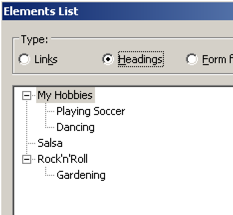
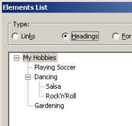

# External Content in iFrames

**Iframes allow to include any external content into a page. As such, precaution must be taken that external content does not mess up the semantics of the surrounding content with improper heading levels and hierarchies.**

In general, screen readers treat content in an iframe like any other content on the page.

In addition, they announce the frame:

- NVDA simply announces "frame".
- JAWS also announces the iframe's `title` attribute, so be sure to always provide a meaningful title to an iframe.

Also, both NVDA and JAWS allow navigating directly to any frame using the `m` key.

[Example](_examples/general-iframe-example)

## Headings in iframes

Screen readers integrate headings from iframes directly into the heading outline of the parent page. This means that you have to be very careful that an embedded content's heading does not badly affect your embedding page's heading outline.

The following bad example illustrates what can happen: the embedded content is meant to be part of the heading on level 2 "Dancing", but it defines its own headings on level 1.

[Example](_examples/bad-iframe-with-interferring-headings)

The resulting headings outline looks like this to a screen reader:

- `<h1>` Hobbies
    - `<h2>` Playing Soccer
    - `<h2>` Dancing
- `<h1>` Salsa
- `<h1>` Rock'n'Roll
    - `<h2>` Gardening

To fix it, the headings in the embedded content need to be on the correct level relatively to the parent page.

[Example](_examples/iframe-with-appropriate-headings)

Now the resulting headings outline looks correct:

- `<h1>` Hobbies
    - `<h2>` Playing Soccer
    - `<h2>` Dancing
        - `<h3>` Salsa
        - `<h3>` Rock'n'Roll
    - `<h2>` Gardening
