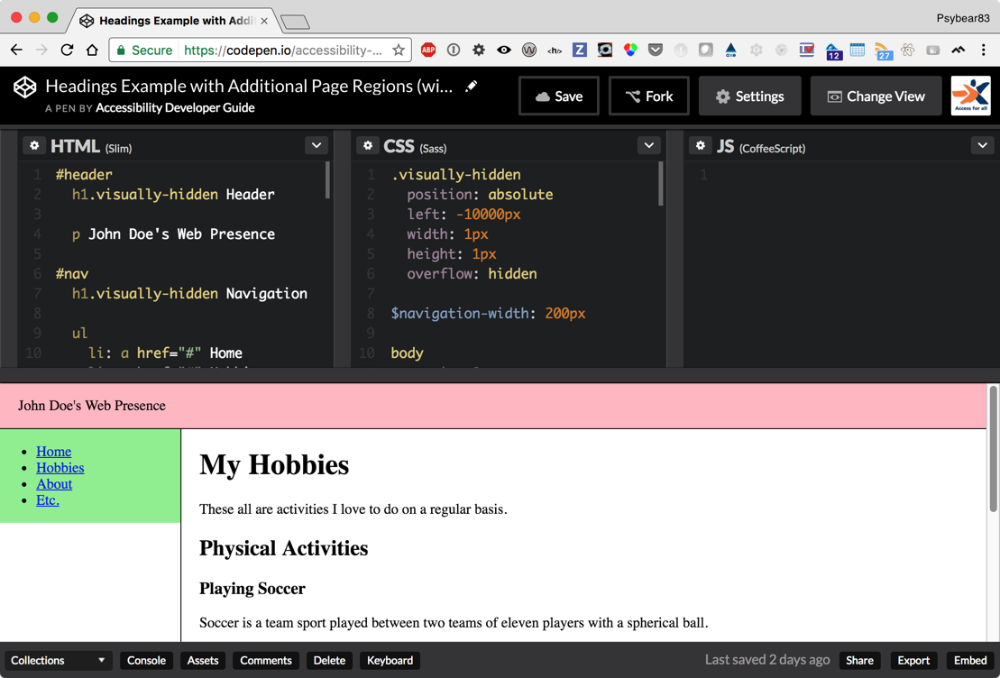

# How to use our code examples on CodePen.io

**[CodePen.io](http://www.codepen.io/) is a great online service. It allows to create HTML/CSS/JavaScript prototypes right from within a browser which makes it the perfect tool for rapid developing and sharing of prototypes.**

## How we use CodePen for this guide

All of our [Examples of accessibility patterns](/examples) are built using CodePen, so called "pens". This allows our readers (you!) to execute them, play around with them, and even edit them - all directly within the browser!

To edit a pen you can [create a fork](https://blog.codepen.io/documentation/features/forks/) of a pen and adapt it to your needs. This feature is also very handy to have different versions of the same CodePen, e.g. for comparing them side by side when searching for the best solution of a specific requirement.

We suggest you [create a user account](https://codepen.io/signup) (**free**) so you have your personal collection of pens always handy.

## Great CodePen features

We love CodePen because of the following features:

- It allows to use [preprocessors](https://blog.codepen.io/documentation/editor/using-html-preprocessors/) for faster and cleaner coding (e.g. [Slim](http://slim-lang.com/) for HTML, [Sass](http://sass-lang.com/) for CSS, and [CoffeeScript](http://coffeescript.org/) for JavaScript)
    - Read [Our codex about clean and maintainable accessibility](/intro/codex) for more info about the meaningfulness of using tools like preprocessors in your development workflow
- Adding common libraries (e.g. [Twitter Bootstrap](http://getbootstrap.com/) or [jQuery](https://jquery.com/)) is a snap, see [Pen Settings, Redesigned](https://blog.codepen.io/2015/05/12/pen-settings-redesigned/) for more infos
- Pens can be organised using tags or be put into [collections](https://blog.codepen.io/documentation/features/collections/)
- The [debug view](https://blog.codepen.io/documentation/views/debug-view/) displays a CodePen without any layout elements added by the CodePen service itself, which is especially useful when doing screen reader testing
    - To view pens of other CodePen users in debug mode, the creator of the specific pen has to be a [pro member of CodePen](https://codepen.io/pro/)
    - You can view your own pens in debug mode though
    - Another option is to use the [full page view](https://blog.codepen.io/documentation/views/full-page-view/) which always is available but shows a small CodePen header on top

## Is CodePen accessible?

Admitted, CodePen's editor could be more accessible, but at the time being, it's the best bet on the web.

## How to use CodePen for rapid prototyping

CodePen is a great tool for agile and rapid prototyping like this:

- Create a first version of a prototype (the "Master")
- Share its link with your team members or your client
- Recipients can play with it and fork the prototype to and make it better
- If proposed changes are sensible, manually add them back to the Master (a merge tool like [Mergely.com](http://www.mergely.com/editor) can be a big help!)