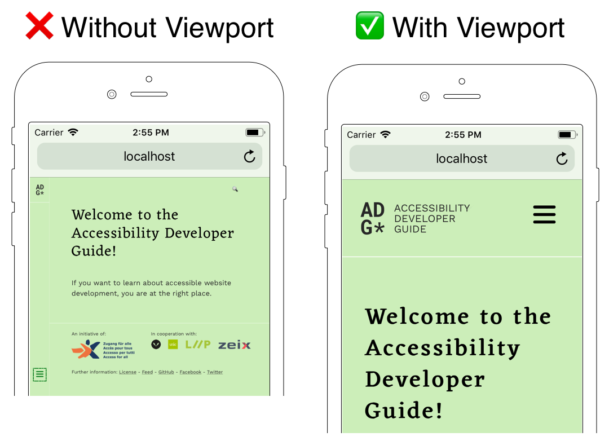

# Basic structure of an accessible HTML file

**An HTML file has a clearly defined structure that allows any browser to render the content correctly. To make an HTML file accessible you need to know the basic structure and its roles.**

As you learned for sure each HTML file consists on the same structure that includes the declaration of the document type, a header part that describes the document followed by a body that contains the actual content:

```html
<!DOCTYPE html>
<html lang="en">
  <head>
    <meta charset="utf-8" />
    <title>Add a meaningul title here</title>
    <meta name="viewport" content="width=device-width, initial-scale=1.0" />
  </head>
  <body>
    Visual content goes here.
  </body>
</html>
```

## What language are you speaking?
We are used to regonize in which language a content is written simply by skimming over the text. When using assistive technologies such as screen readers, it is crucial to know the language of the content in advance. In the example of a screen reader, the synthesizer needs to know which language the content is, to pronunciate the output correclty. Otherwise it will be hard to understand, even if you know the other language.

By adding the language attribute `lang` to any HTML tag we can define the language of the enclosed content. `<html lang="en">` for example defines the documents content by default as english.

## A document should have a meaningful title
The `title` element in the header section phrase the purpose of the document in the browser toolbar, provides a name when a page is added to favorites and displays the title for the page in search engine results. In addition it plays an important role in accessibility.

```html
<title>Add a meaningul title here - ACME Inc.</title>
```

When using a screen reader the title element will be announced after the page is loaded. This enables users to identify a website without scanning the whole content. A meaningful title could be «Contact form - ACME Inc.». Also don't forget to append your websites name in the title so the user always knows which website the current page belongs.

In addition to the <a href="/examples/sensible-aria-usage/alert/">alert role</a> the title element can be used to gain users attention, for example when a validation failed after submiting a form, i.e «Contact form could not be sent. Please provide a valid email address.» or «You have successfully logged in. - ACME Inc.». 

## Set the viewport to the width of the device
Good websites are responsive so that content is rendered well on every device. For example mobile devices are rendering pages at typical desktop screen size and then scales to fit the mobile screen. In this case the content appears very small. Users are forced to pinch-to-zoom and scroll around to scan the content. This is a challenge not only for users with special needs.



Responsivness can be achieved by set the viewport with to the width of the device and an initial zoom scale of 1.

```html
<meta name="viewport" content="width=device-width, initial-scale=1.0" />
```

You have also to take care of how the design is adapting at different screen sizes. In respect of accessibilty keep users should only need to click and scroll vertically.
