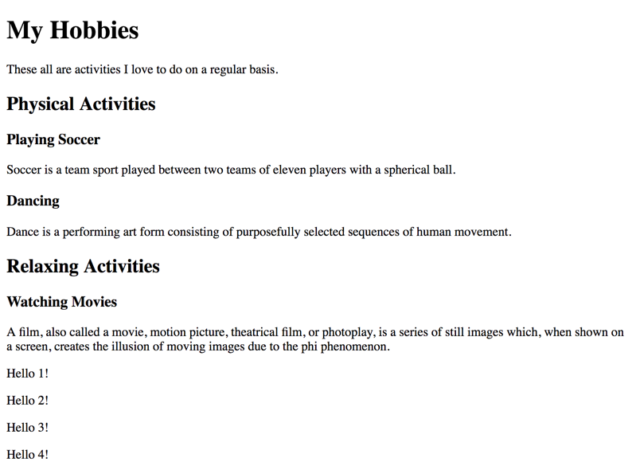
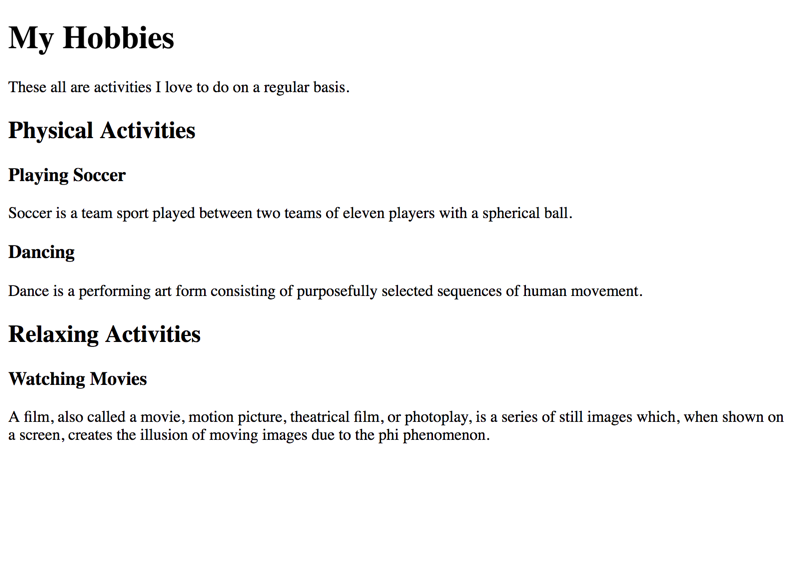

# Noticing screen readers using alert role

**ARIA provides a role which makes screen readers announce an element immediately after its addition to the DOM (using JavaScript). While this works in most browsers and screen readers, it must be used with extreme caution as it interrupts the screen reader's current output.**

## Background

As we know from [Screen readers process contents in a linear way](/pages/knowledge/desktop-screen-readers/linear-processing), screen readers are always on one single point of a page, so they are not aware of changes to the document that happen somewhere else. Using `role="alert"` though, you can force a newly added element's content to be announced anyway.

## Intended use

Setting `role="alert"` to a newly added DOM element (using JavaScript) forces the screen reader to announce its content, regardless of what it is doing right now.

In the following code, the user is greeted "Hello!" after 10 seconds.

```html
<p>
  The user may read this paragraph...
</p>

<p>
  ...or this paragraph.
</p>

<div id="alert"></div>
```

```javascript
var sayHello;
sayHello = function() {
  return $("#alert").append("<p role='alert'>Hello!</p>");
};

return setTimeout(sayHello, 10000);
```

[Single announcement of an element using alert role (example) ](_examples/single-announcement-of-an-element-using-alert-role)

## Peculiarities and side effects

### Interruption of current announcement

You may have noticed that the screen reader's current announcement was brutally aborted by the "Hello!" alert. This can be distracting and confusing.

But look at the following, more extreme example, where the user is greeted very 2 seconds:

```javascript
var sayHello;
sayHello = function() {
  $("#alert").append(`<p role='alert'>Hello!</p>`);
};

setInterval(sayHello, 2000);
```

This is extremely disturbing, as the user is interrupted again and again while browsing the page. Something like this can destroy the whole user experience for screen reader users.

[Loop announcement of an element using alert role (example) ](_examples/loop-announcement-of-an-element-using-alert-role)

### Where does it come from?

It generally is bad style to expect users to notice a change to the page without forcing their attention on it.

We sometimes see things like a visual warning text popping up somewhere on a page, warning: "Your session is running out, please extend!". Chances are high that even visual users will not notice it, as they are looking somewhere else right now (maybe at their keyboard).

For screen reader users it is similar: even if this message is announced using `role="alert"`, they have no idea where it comes from and as such where to extend their session.

As `role="alert"` even seems to work across multiple tabs, this makes the whole thing even more difficult, meaning that they are announced by screen readers even if the user is browsing on a different tab.

How disturbing is that?

### Hidden alerts are not recognised

It is important to note that the element with `role="alert"` must be visible on the page, otherwise it is not recognised by screen readers.

In the following example, the element containing the alerts are hidden using `hidden` attribute (see [Hiding elements from all devices](/pages/examples/hiding-elements/from-all-devices)). As such, the alerts are not announced by screen readers.

[Loop announcement of an element using hidden alert role (example) ](_examples/loop-announcement-of-an-element-using-hidden-alert-role)

## Live regions - an alternative?

Admitted, ARIA offers more sophisticated alert types which attenuate some of the problems explained above: [Live Regions (Mozilla.org)](https://developer.mozilla.org/en-US/docs/Web/Accessibility/ARIA/ARIA_Live_Regions) offer settings like a "polite" announcement style that does not interrupt the current announcement.

But in contrast to `role="alert"`, these live regions are not supported in a homogenous way by browsers and screen readers, so in our experience, they are very tricky to implement.

## Real world use (and conclusion)

In our opinion, the only appropriate use for `role="alert"` is to announce a change that happened immediately as a result of a user action.

For example, when letting the user filter a list of elements using a text input. In this case, after the user typed a letter "T", the list is reduced to elements that contain a "T" in their name, and the screen reader would immediately alert "2 of 5 elements filtered".

You can find an example for this here: [Autosuggest widget (or: autocomplete, lookahead, typeahead)](/pages/examples/widgets/autosuggest).