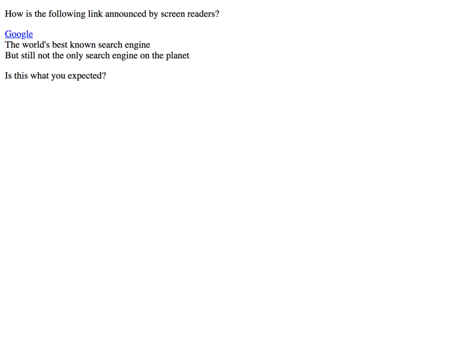

# Adding descriptions to elements using aria-describedby

**ARIA provides an attribute which allows to attach other elements as descriptions to an element. They work pretty non-uniformly in modern browsers and screen readers, and as such they must be used with extreme caution.**

## Background

In addition to an element's label (see [Labelling elements using aria-label and aria-labelledby](/pages/examples/sensible-aria-usage/label-labelledby)), screen readers can announce a referenced element (or more than one) as its description.

## Intended use

Using `aria-describedby`, any number of elements can be set as description(s) of another element (by referencing their IDs). For example, the following link's description is "The world's best known search engine":

```html
<a href="..." aria-describedby="description">
  Google
</a>

<div id="description">
  The world's best known search engine
</div>
```

By the way, elements hidden using CSS can still be referenced:

```css
##description {
  display: none;
}
```

So a screen reader will announce:

> Google. The world's best known search engine. Link.

[Adding a description to an element using aria-describedby (example) ](_examples/adding-a-description-to-an-element-using-aria-describedby)

### Multiple descriptions

The value of `aria-describedby` can contain more than a single ID. Each referenced ID is attached as a description.

[Adding multiple descriptions to an element using aria-describedby (example) ](_examples/adding-multiple-descriptions-to-an-element-using-aria-describedby)

## Peculiarities and side effects

### Browse vs. focus mode

Both Firefox and Internet Explorer respect `aria-describedby` only in focus mode. As such, it does not make sense to add it to non-focusable elements.

### Differences between screen readers

While NVDA announces descriptions right away, JAWS sometimes prompts to manually press `JAWS + Alt + R` to announce it.

### Text not searchable

Text hidden with `display: none` but referenced using `aria-describedby` is not searchable in browsers. This is confusing to screen reader users, as they may not be aware of any difference between "normal" text and `aria-describedby` text.

## Real world use

The only case where we truly recommend the usage of `aria-describedby`, is to attach additional information to interactive elements.

- Regarding form controls, see [Validation messages](/pages/examples/forms/validation-messages) and [Placing non-interactive content between form controls](/pages/examples/forms/non-interactive-content).
- Regarding all sorts of widgets, see [Interactive widgets](/pages/examples/widgets).

For this, the information itself must be visible (and as such discoverable also in browse mode) and as close as possible to the element it describes.

If instead you need to attach information that itself is invisible, you better use visually hidden text (see [Hiding elements visually by moving them off-screen](/pages/examples/hiding-elements/visually)). For an example, see [Indicating form controls as required using asterisks (*)](/pages/examples/forms/required-).

## Conclusion

Due to the described peculiarities and side effects, we in general do not recommend to use `aria-describedby`, except for adding information to interactive controls.