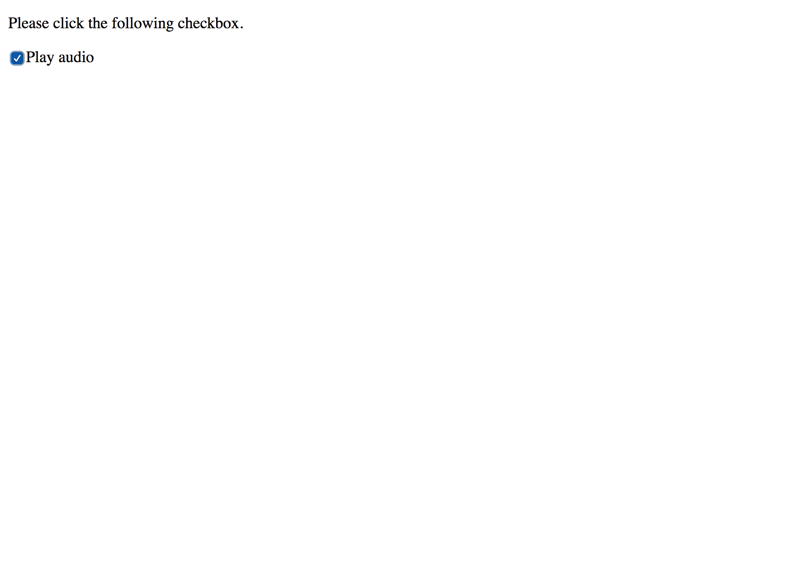

# Marking elements activatable using aria-pressed

**ARIA provides an attribute which allows to mark an element as activatable. It works pretty uniformly in modern browsers and screen readers. Still, for most situations there exist alternative techniques that are more robust.**

## Background

In modern web applications there are often situations where the user needs to be able to toggle an element's activity.

On a visual level, this status typically is indicated using icons, for example a "play/pause" icon for an audio player. But this information needs to be available also on the semantical level, so screen readers can announce it.

## Intended use

On a semantical level, the `aria-pressed` attribute is a good choice to convey that an element's visibility can be activated, together with its current state:

```html
<button aria-pressed="false">
  Toggle
</button>
```

A screen reader will announce:

> Toggle. Button not pressed.

If the button is activated (and the `aria-pressed` status is changed to `true` by JavaScript), the screen reader will announce this change:

> Pressed.

[Marking an element togglable using aria-pressed (example) ](_examples/marking-an-element-togglable-using-aria-pressed)

## Real world use

As shown above, if the button's `aria-pressed` value is changed using JavaScript while it is focused, screen readers announce the change. This is pretty exceptional, as most other changes to an element are not detected by screen readers (and as such not announced).

In line with the requirement that every user interaction must result in an adequate feedback (see [How to implement websites that are ready for screen reader usage](/pages/knowledge/desktop-screen-readers/how-to-implement)), the `aria-pressed` attribute may seem really useful for elements like that toggle something, for example a "Play audio" button.

But in fact, there is an even simpler and more robust way to implement this using a checkbox.

### Alternative technique using checkbox

Instead of fiddling around with ARIA, you can achieve the same result using a traditional checkbox (styled to your likings).

[Marking an element toggleable using a checkbox (example) ](_examples/marking-an-element-toggleable-using-a-checkbox)

While this is even more robust than using `aria-pressed`, it may feel out of place within a "real" form.

### Do not confuse with aria-selected

There is another, similarly appealing ARIA attribute called `aria-selected`: it can only be used together with certain roles (for example `role="tablist"`) and as such should not be confused with `aria-pressed`.

### Do not use for marking expandability

If you need to mark that the visibility of an element can be toggled, instead of `aria-pressed`, you should use `aria-expanded`, see [Marking elements expandable using aria-expanded](/pages/examples/sensible-aria-usage/expanded).

## Conclusion

If you need to describe the activatable status of interactive elements, `aria-pressed` is one of the few ARIA attributes we can recommend for general use. The alternative technique using a checkbox may be even more robust though (especially outside of forms).

In the end it is up to you what technique you choose.