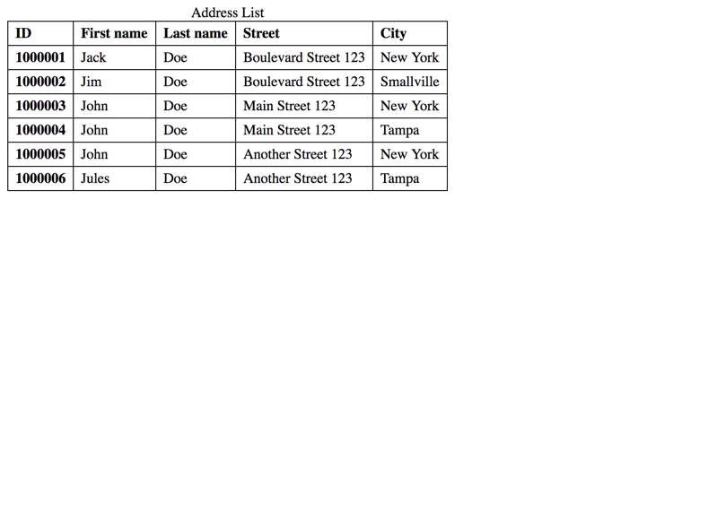

# Multiple header cells in a table support identification

**A table's header cells are in charge of making the corresponding data cells distinguishable, so users can easily identify data cells and navigate through the table flawlessly. But sometimes it is hard to find the correct cells that fit in this respect, so you can try to introduce another one - or to use a combination of cells.**

## Ambiguous data

Sometimes a data table doesn't offer a column that identifies the current row (so it could be used as the `<th>` element).

For example, when having a huge database of addresses, chances are high that you have multiple records with very similar data, as demonstrated in the following example: here you have many John Does residing on similar addresses.

[Table with ambiguous data (example) ](_examples/table-with-ambiguous-data)

## Adding a unique identifier

In such a case, you could try to introduce an additional unique column, like a record ID.

[Table with unique IDs (example) ](_examples/table-with-unique-ids)

However, record IDs are often not very readable. And sometimes there isn't even a record ID available.

## Marking multiple cells as headers

Thus, sometimes it is best to mark more than a single data cell as header cell. Then, the combination of the header cells is announced by the screen reader, identifying the current row as uniquely as possible.

[Table with multiple header cells (example) ](_examples/table-with-multiple-header-cells)

## How many header cells are too many?

As you see in the example above, the combinations of first and last names still aren't unique. So you could add even more cells as header cells...

But please don't overdo this. You usually should never need more than two or maybe three header cells for a row, even if they are not fully identifying each and every record. This is better than having all of the cells marked up as header cells (which would be absurd).