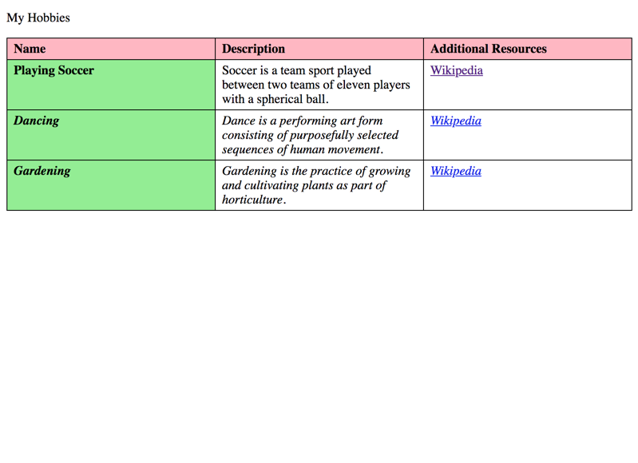

# The "table of divs" experiment

**Instead of using traditional HTML table elements, it is also possible to convert a structure of non-table elements into a table using ARIA. This is an experiment, and we explicitly do not recommend using this on productive websites. So please, kids, don't try this at home!**

## A table of divs

As we have seen, it is possible to re-apply semantics to an element that has somehow lost its inherent semantics. This is done using ARIA (if you haven't done this yet, go back and read [Responsive tables](/pages/examples/tables/responsive)).

We can try to follow this approach "ad absurdum" by trying to add all needed semantics using ARIA alone.

So the following example is an experiment with a purely demonstrative purpose. It contains an HTML structure that is made of pure `
` elements (so nothing like `<table>`, `<tr>`, `<td>`, or similar was used). Thanks to adding an appropriate `role` attribute to each element, it is conveyed to screen readers like a table.

[Table of divs using ARIA (example) ](_examples/table-of-divs-using-aria)

_Q.E.D._ (Quod erat demonstrandum.)

## Total freedom of styling

As all roles can be set explicitly using ARIA, we are not restricted anymore styling the table in any traditional way. For example, instead of using `display: table`, `display: table-row`, and `display: table-cell`, etc., we can now style a table as flexbox:

[Table of divs with flexbox (example) ](_examples/table-of-divs-with-flexbox)

## Necessity of a valid structure

When tinkering up a table using random HTML elements and ARIA roles, it is very important that the used structure of elements (and roles) resembles a valid HTML table.

### A slightly invalid structure

The following example adds another `
` container around the second and third hobby's `<tr>` elements so we can style those individually. This breaks the table for some screen readers: for example, NVDA announces it as "table with 2 rows and 3 columns" (instead of 4 rows), and for the second and third hobby, table navigation does not work anymore.

[Invalid table of divs (example) ](_examples/invalid-table-of-divs)

This should not be too much surprising: in standard HTML, adding a container around `<tr>` elements is not valid, either. And although the above example is still working in some screen readers, the following always holds true: the messier the HTML code is, the more problems will occur.

### Making it valid again

The good news: by adding `role="presentation"` to this additional container, we remove its semantical meaning, and the table is working again (also in NVDA).

[Fixed table of divs (example) ](_examples/fixed-table-of-divs)

## Conclusion

While pure ARIA tables seem to work pretty well in most modern screen readers, we highly discourage using them in productive websites.

Generally speaking, the above example is a case of one of ARIA's typical mis-usages, namely fixing broken semantics (if you haven't done this yet, go back and read [Bad ARIA practices](/pages/knowledge/aria/bad-practices)).

The use of real, traditional table structures makes it much easier to spot table-like data directly in the DOM. Also, they are fully backwards compatible, while ARIA requires pretty advanced browsers and screen readers.