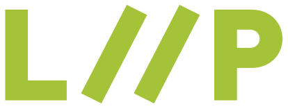
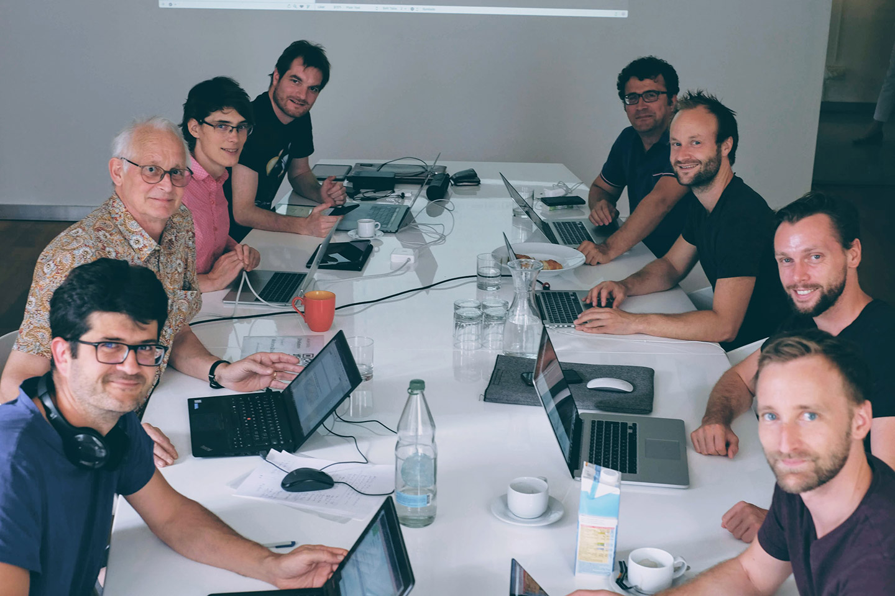

# About us

**The «Accessibility Developer Guide» (ADG) in its entirety is the result of many years of hands-on practice in the field of testing websites for accessibility, as well as developing accessible web applications. The daily experience of user experts with special needs, blended together with the profound technical knowledge of fullstack web developers, resulted in forming the «Accessibility Alliance».**

## «Access for all»

On one side of the «Accessibility Alliance», there is the Swiss Foundation «Access for all», which is the initiator and leader of the whole initiative. It consists of a small team of accessibility experts and web developers, half of which having special needs themselves.

{.zfa-logo}

The foundation is in business since the year 2000, and since then has accompanied hundreds of local and international websites in the process of becoming accessible. The basis for this have always been the official guidelines like the [Web Content Accessibility Guidelines](https://www.w3.org/WAI/standards-guidelines/wcag/) (WCAG) and [Accessible Rich Internet Applications](https://www.w3.org/TR/html-aria/) (ARIA), combined with the real-life experiences of those employees with special needs, and profound expertise of fullstack web developers. In one sentence: the contents of this guide are the result of nearly two decades of hands-on experience in all topics accessibility.

> With the ADG, the «Access for all» foundation provides developers with an instrument that offers practical and concrete support in the implementation of accessible web offerings. As an open source project, ADG focuses on sharing and passing on knowledge. All agencies, every woman and every man are invited to join the Accessibility Alliance. Join in a few developer days a year - and you'll be there.

**Bernhard Heinser**, CEO, «Access for all».

For more information, see [www.access-for-all.ch](http://access-for-all.ch/).

## Web agencies

On the other side of the «Accessibility Alliance», there are several acclaimed web agencies. They provided the technical solution and visual design for the guide, gave support in marketing it, etc.

### Hinderling-Volkart

{.agency-logo}

> Until now, web developers have lacked a good, practical reference on accessibility. It doesn't need more rules, but more guidance to make the web usable for everyone. The ADG will provide access where hardly anyone has been before, with practical examples, tested by experts and supported by developers. From the very beginning we were convinced of the purpose of this commitment and are proud to be able to contribute a small part to it.

**Severin Klaus**, frontend leader, [Hinderling-Volkart](https://www.hinderlingvolkart.com/).

### UNIC

{.agency-logo}

> Accessibility is complex. The development of the necessary know-how is correspondingly complex. That is why we have helped to develop the ADG. In the future, it will be a central tool for creating accessible websites for everyone. We are very much looking forward to a lively exchange with the front-end community in order to further develop the ADG together.

**Thomas Jaggi**, expert frontend engineer, [UNIC AG](https://www.unic.com/).

### Liip

{.agency-logo}

> As a web agency committed to provide continuous improvements to the way the internet is built and used, Liip is excited to join and contribute to the ADG initiative. In our inclusive vision, this will bring benefits to everyone, first to the developers but finally to the end-users. The Open Source nature of the project, furthermore, fully embraces our principles and opens the doors to worldwide contributions.

**Donato Rotunno**, senior frontend developer, [Liip AG](https://www.liip.ch/en).

### Zeix

{.agency-logo}

> The ADG allows us to easily share knowledge within the team and build on reliable best practices. This enables us to design, create and program websites that all people like to use.

**Esther Brunner**, user interface developer, [Zeix AG](https://zeix.com/).

### Your company here?

Our guide is a community driven resource: everybody is welcome to become a part in the movement of making the Internet a more accessible place.

Please read on.

## Join the «Accessibility Alliance»!

Get in touch with us through:

- Facebook: [AccessibilityDeveloperGuide](https://www.facebook.com/AccessibilityDeveloperGuide)
- Twitter: [A11yDevGuide](https://twitter.com/A11yDevGuide)

### The main team

During the last months, a main group of people regularly gathered around developing the ADG.

Clockwise from top right:

- **Donato Rotunno**, web developer at Liip.
- **Joshua Muheim**, web developer and accessibility expert at «Access for all», initiator of and main contributor to the ADG.
- **Jürgen Rudigier**, frontend developer at Hinderling-Volkart.
- **Thomas Jaggi**, web developer at UNIC.
- **Anton Bolfing**, accessibility expert at «Access for all», responsible for final editing and testing of the ADG.
- **Bernhard Heinser**, CEO at «Access for all», project leader of the ADG.
- **Esther Brunner**, web developer at Zeix.
- **Markus Graf**, web developer.

### The testing staff

Not to forget our highly respected testing staff who took care of validating all contents and code examples (all of them working for «Access for all»):

- **Daniele Corciulo**, blind accessibility expert.
- **Gianfranco Giudice**, blind accessibility expert.
- **Petra Ritter**, multiple-handicapped accessibility expert.
- **Mohamed Sherif**, blind accessibility trainee.
- **Reto Inniger**, vision-impaired accessibility trainee.
- **Romano Spescha**, vision-impaired accessibility trainee.
