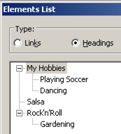
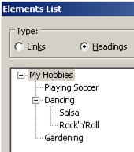

# External Content in iFrames

In general, screen readers treat content in an iframe like any other content on the page.

In addition, they announce the frame:

- NVDA simply announces _"frame"_
- JAWS also announces the iframe's `title` attribute, so be sure to always provide a meaningful title to an iframe

Also, both NVDA and JAWS allow navigating directly to any frame using the `m` key.

[**General iFrame Example**](https://codepen.io/accessibility-developer-guide/pen/aybwMM){.code}

# Headings in iframes

Screen readers integrate headings from iframes directly into the heading outline of the parent page. This means that you have to be very careful that an embedded content's heading doesn't badly affect your parent's heading outline!

The following bad example illustrates what can happen: the embedded content is meant to be part of the heading on level 2 "Dancing", but it defines its own headings on level 1.

[**iFrame Example With Wrong Embedded Heading**](https://codepen.io/accessibility-developer-guide/pen/BdNBVG){.code}

The resulting headings outline looks like this to a screen reader:

{.image}

- `<h1>` Hobbies
    - `<h2>` Playing Soccer
    - `<h2>` Dancing
- `<h1>` Salsa
- `<h1>` Rock'n'Roll
    - `<h2>` Gardening

To fix it, the headings in the embedded content need to be on the correct level relatively to the parent page.

[**iFrame Example With Correct Embedded Heading**](https://codepen.io/accessibility-developer-guide/pen/oeXvRp){.code}

Now the resulting headings outline looks correct:

{.image}

- `<h1>` Hobbies
    - `<h2>` Playing Soccer
    - `<h2>` Dancing
        - `<h3>` Salsa
        - `<h3>` Rock'n'Roll
    - `<h2>` Gardening

## More about accessible heading outlines

The learn more about accessible heading outlines, take a look at page [Heading outlines](/part--examples-of-accessibility-patterns---introduction/heading-outlines){.page} (and specifically at its sub page [HTML5's headings outline algorithm](/part--examples-of-accessibility-patterns---introduction/heading-outlines/html5s-headings-outline-algorithm){.page}).

# Other resources

You can find additional information here: [Creating Accessible Frames and Iframes](http://webaim.org/techniques/frames/).