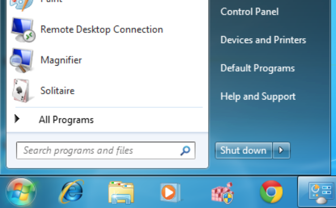

# Configuring VMware Fusion on macOS

# Preparing the virtual machine

Before you proceed, be sure you have downloaded a pre-configured virtual machine (VM) like described here: [Getting a free Windows virtual machine from Modern.IE](/part--setup-of-the-accessibility-environment---introduction/chapter--windows-virtual-machine---overview/getting-a-free-windows-virtual-machine-from-modern-ie){.page}.

Then extract the VM (using [The Unarchiver](http://wakaba.c3.cx/s/apps/unarchiver.html), as the built-in unzip version isn't capable of zip64 files) to a proper location, for example `~/Virtual Machines`.

# Installing VMware Fusion

{.image}

- Download [VMware Fusion](http://www.vmware.com/ch/products/fusion), install and launch it.
- Choose `File` -> `Import`, select the `*.ovf` file in the extracted folder and confirm.
- Take a snapshot (`Command + Shift + S`).
    - This allows to easily go back to that state later, meaning you can re-activate the VM's Windows 90 days license again and again.
    - For more info, see [Understanding snapshots (VMware)](https://kb.vmware.com/s/article/1014509).
- Under `Virtual Machine` -> `Settings`:
    - If you have a retina display, go to `Display` and deselect `Use full resolution for Retina display` (otherwise your eyes will begin to hurt).
    - Go to `Processors & Memory`, then select at least 2000MB of memory.
    - To be able to connect to the internet, click `Add Device...` and choose `Network Adapter`.
        - Use option `Share with my Mac`.

# Booting up the VM for the first time

Start the VM. User and password can be found here: [Getting a free Windows virtual machine from Modern.IE](/part--setup-of-the-accessibility-environment---introduction/chapter--windows-virtual-machine---overview/getting-a-free-windows-virtual-machine-from-modern-ie){.page}.

# Improving seamless integration

Simply having a Windows machine run on your beloved Mac may already feel creepy. To make you feel as comfortable as possible when working with it, we suggest the following additional configuration steps.

## Disabling left Windows key

{.image}

- In VMware Fusion , the left `Command` key by default is assigned to the left `Windows` key.
- Pressing `Command + Tab` therefore often interferes with the left `Windows` key, opening and closing the "Start" menu of the VM seemingly randomly.
- If you want to disable this:
    - `VMware Fusion` -> `Preferences` -> `Keyboard & Mouse` -> `Mac Host Shortcuts`.
    - Then under `For Windows key, use` select `Right Command key`.

Note: This seems to have been fixed in more recent versions of VMware Fusion (at least in version 10 it's not an issue anymore).

## Changing behaviour of function keys

{.image}

- Windows screen readers make use of the function keys (`F1` to `F12`) a lot.
- By default, you have to press the `Fn` key in addition to the specific function key to trigger it.
- As screen reader shortcuts are quite tricky already, we suggest that you [change the behaviour of function keys (Apple Support)](https://support.apple.com/en-us/HT204436).

## Emulating the Insert key

{.image}

Windows screen readers rely heavily on the `Insert` key which isn't available on Macs, so you will have to emulate it. The easiest way to do this is using the SharpKeys software.

- SharpKeys translates any given key to any other (in the VM itself).
- In the VM, download [SharpKeys](http://sharpkeys.codeplex.com/), install and launch it.
- Click `Add`, then map any key you like (e.g. the `Right Windows` key `E0_5C`) to `Insert` key `E0_52`.
- Click `OK` and `Write to Registry`.
- Restart the VM.

Alternatively, you can attach a physical [USB num lock keyboard](http://lmgtfy.com/?q=USB+num+lock+keyboard) (or any other keyboard offering an `Insert` key) to your Mac.

# Working seamlessly with the VM

- We think it's easiest to have VMware running in `Single Window` mode (default).
    - Use `Command + Tab` to switch between Mac apps.
    - Use `Option + Tab` to switch between Windows apps (when VMware is active).
- If you want all Windows apps to be accessible from the Dock (and thus also in the application switcher when pressing `Command + Tab`), the "Unity" mode is pretty cool, too.
    - Even the Windows' task bar icons will appear in the Mac's menu bar.