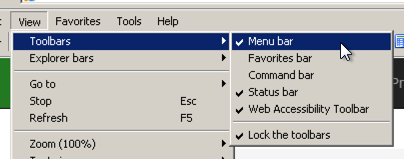

# Internet Explorer 11 (IE11) browser: installation and configuration

{.image}

For more info, see [Relevant combinations of screen readers and browsers](/knowledge-about-developing-and-testing-accessible-websites/introduction-to-desktop-screen-reader-usage/relevant-combinations-of-screen-readers-and-browsers){.page}.

# Installation

[Internet Explorer](http://windows.microsoft.com/en-US/internet-explorer/download-ie) is already installed in a Windows environment. This may be the reason why it's still the most wide-spread browser used with JAWS.

## Internet Explorer, not Edge!

Be sure you're really running Internet Explorer version 11, and not Edge!

Regarding screenreader usage, [Edge](http://windows.microsoft.com/en-US/windows-10/getstarted-get-to-know-microsoft-edge) is **not** relevant yet.

# Configuration

## Displaying relevant toolbars

{.image}

Make sure that in the menu, under `View > Toolbars`, at least the following items are selected:

- Menu bar
- Status bar
- Web accessibility toolbar

If you don't see the menu, press the `Alt` key once.

## Restoring tabs after restart

You may want to [restore tabs in IE upon restart](http://www.thewindowsclub.com/internet-explorer-restore-last-browsing-session).